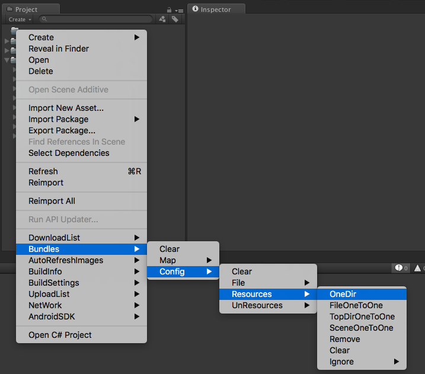
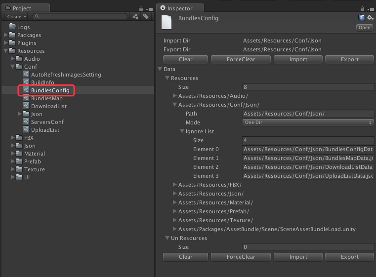
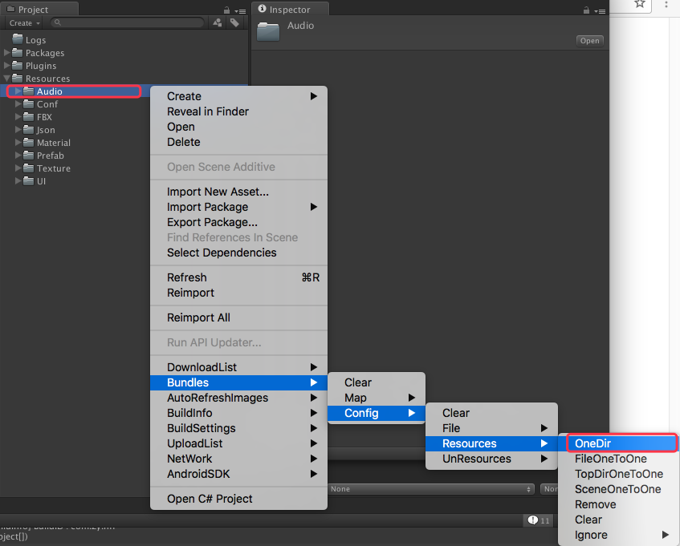
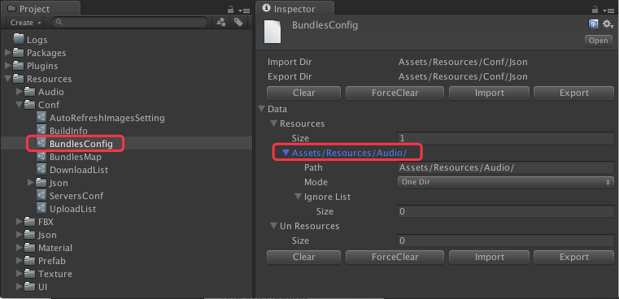
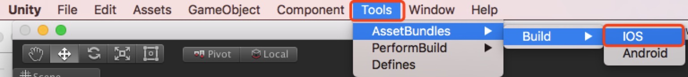

# 概述

--------------------------------

## 目录

3.[资源打包](AssetBundle.md#3%E8%B5%84%E6%BA%90%E6%89%93%E5%8C%85)

3.1.[打包模式](AssetBundle.md#31%E6%89%93%E5%8C%85%E6%A8%A1%E5%BC%8F)

3.2.[设定文件](AssetBundle.md#32%E8%AE%BE%E5%AE%9A%E6%96%87%E4%BB%B6)

3.2.1.[项目设定说明](AssetBundle.md#321%E9%A1%B9%E7%9B%AE%E8%AE%BE%E5%AE%9A%E8%AF%B4%E6%98%8E)

3.2.2.[资源设定说明](AssetBundle.md#322%E8%B5%84%E6%BA%90%E8%AE%BE%E5%AE%9A%E8%AF%B4%E6%98%8E)

3.3.[打包步骤](AssetBundle.md#33%E6%89%93%E5%8C%85%E6%AD%A5%E9%AA%A4)

3.4.[打包依赖Map](AssetBundle.md#34%E6%89%93%E5%8C%85%E4%BE%9D%E8%B5%96map)

3.4.1.[项目设定说明](AssetBundle.md#341%E9%A1%B9%E7%9B%AE%E8%AE%BE%E5%AE%9A%E8%AF%B4%E6%98%8E)

3.4.2.[依赖Map设定说明](AssetBundle.md#342%E4%BE%9D%E8%B5%96map%E8%AE%BE%E5%AE%9A%E8%AF%B4%E6%98%8E)

--------------------------------

## 3.资源打包

[返回目录](README.md#%E7%9B%AE%E5%BD%95)

资源打包是，对Unity3d工程中指定资源进行AssetBundle打包，并通过下载可以进行动态更新的资源包（可以视为非lua的热更新）。

### 3.1.打包模式

[返回目录](README.md#%E7%9B%AE%E5%BD%95)

打包资源模式分为：OneDir（单一目录模式），FileOneToOne（文件一对一模式），TopDirOneToOne（子目录一对一模式），SceneOneToOne（场景一对一模式）。`详细见 表 3-1-1`

`表 3-1-1`

| 模式名 | 说明 | 备注 |
|:------|:----|:-----|
| OneDir | 单一目录模式 | 以单一选中目录为目标进行资源打包 |
| FileOneToOne | 文件一对一模式 | 以单一选中文件为目标进行资源打包 |
| TopDirOneToOne | 子目录一对一模式 | 以指定目录下，各个子目录为目标进行资源打包 |
| SceneOneToOne | 场景一对一模式 | 以单一选中场景为目标进行资源打包 |

在Project视窗中，右键菜单按钮可以简单对上述四种模式进行操作。`详细见 图 3-1-1`

`图 3-1-1 打包`

### 3.2.设定文件

[返回目录](README.md#%E7%9B%AE%E5%BD%95)

`设定文件名：`BundlesConfig.asset

`保存路径：`Assets/Resources/Conf/

`数据导入/导出路径：`Assets/Resources/Conf/Json

`详细见 图 3-2-1`

`图 3-2-1 设定文件`

#### 3.2.1.项目设定说明

[返回目录](README.md#%E7%9B%AE%E5%BD%95)

项目设定说明`详细见 表 3-2-1-1`

`表 3-2-1-1`

| 项目名 | 说明 | 备注 |
|:------|:----|:-----|
| <B>ImportDir</B> | 数据导入目录 | * 一般情况下，均为`Assets/Resources/Conf/Json`。个别设定，`有所差异`。 * 导入/导出文件均为`Json`格式 |
| <B>ExportDir</B> | 数据导出目录 | * 一般情况下，均为`Assets/Resources/Conf/Json`。个别设定，`有所差异`。  * 导入/导出文件均为`Json`格式 |
| <B>顶部/底部功能按钮条</B> | 默认按钮有  1.清空  2.强制清空   3.导入  4.导出 | 个别设定，功能按钮条会`有所差异`   * 清空：单纯清空当前设定文件数据。  * 强制清空：不仅仅清空当前设定文件数据， `连导入／导出的Json文件也会清空`。  * 导入：从Json文件重新把数据导入。  * 导出：将设定文件的数据导出到Json文件 |
| <B>Resources</B> | 资源列表 | - |

#### 3.2.2.资源设定说明

[返回目录](README.md#%E7%9B%AE%E5%BD%95)

资源设定说明`详细见 表 3-2-2-1`

`表 3-2-2-1 资源设定说明`

| 项目名 | 说明 | 备注 |
|:------|:----|:-----|
| Path | 路径 | * `资源包ID`是以此Path作为基准，转化而来。  * `转化规则:`如: Assets/Resources/Conf/Json -> `assets_resources_conf_json_`   * `资源包文件`:`[资源包ID]`.`[文件后缀名]`  * `资源包Manifest文件`:`[资源包ID]`.`[文件后缀名]`.`manifest`   * `文件后缀名详见:`[4.2.1.上传列表项目说明](Upload.md#421%E4%B8%8A%E4%BC%A0%E5%88%97%E8%A1%A8%E9%A1%B9%E7%9B%AE%E8%AF%B4%E6%98%8E) |
| Mode | 打包模式 | `详见：`[3.1.打包模式](AssetBundle.md#31%E6%89%93%E5%8C%85%E6%A8%A1%E5%BC%8F) |
| Ignore List | 忽略列表 | 在该列表中的对象，将不会背打进AssetBundle包 |

### 3.3.打包步骤

[返回目录](README.md#%E7%9B%AE%E5%BD%95)

1）在Project中选中相关资源，并将资源设置成打包对象。

添加方法，在Project视图中，在右键菜单中按如下操作

`Menu` -> `Bundles` -> `Config` -> `Resources` -> `OneDir`

`详细见 图 3-3-1`

`图 3-3-1 追加目标`

`说明：`

将目标：Assets/Resources/Audio文件见作为一个资源打包对象追加到AssetBundle打包设定中。结果`详见 图 3-3-2`

`模式详见:`[3.1.打包模式](AssetBundle.md#31%E6%89%93%E5%8C%85%E6%A8%A1%E5%BC%8F)
其余打包模式也都类似，可以多尝试几次。就明白了。
当然也可以添加忽略对象。操作如下

追加:`Menu` -> `Bundles` -> `Config` -> `Resources` -> `Ignore` -> `Ignore`

移除:`Menu` -> `Bundles` -> `Config` -> `Resources` -> `Ignore` -> `Remove`

清空:`Menu` -> `Bundles` -> `Config` -> `Resources` -> `Ignore` -> `Clear`

`图 3-3-2 追加结果`

2) 执行打包

执行打包操作如下：

IOS:`Tools` -> `AssetBundles` -> `Build` -> `IOS`

Android:`Tools` -> `AssetBundles` -> `Build` -> `Android`

`注意：`iOS和Android以及不同平台的打包，必须分开打包。（目前仅支持iOS和Android）

`详细见 图 3-3-3`

`图 3-3-3 执行打包`

3）检查打包依赖Map

上述2）执行打包后，会根据1）中设定问打包对象，生成打包依赖Map文件。该文件跟之后资源下载更新后，App启动加载目标&以及依赖关系相关。`详见：`[3.4.打包依赖Map](AssetBundle.md#34%E6%89%93%E5%8C%85%E4%BE%9D%E8%B5%96map)

4) 生成上传文件脚本

执行2）之后，同步将会自动生成上传文件脚本：`Upload.sh`

`生成文件保存路径：`../Shell/Upload.sh

`注意：`生成的上传脚本，会自动使用Ftp方式上传。Ftp服务器相关设定，`详见:`[2.2.上传服务器设定](Servers.md#22%E4%B8%8A%E4%BC%A0%E6%9C%8D%E5%8A%A1%E5%99%A8%E8%AE%BE%E5%AE%9A)

### 3.4.打包依赖Map

[返回目录](README.md#%E7%9B%AE%E5%BD%95)

`设定文件名：`BundlesMap.asset

`保存路径：`Assets/Resources/Conf/

`数据导入/导出路径：`Assets/Resources/Conf/Json

`详细见 图 3-3-4 打包依赖Map`

#### 3.4.1.项目设定说明

[返回目录](README.md#%E7%9B%AE%E5%BD%95)

项目设定说明`详细见 表 3-4-1-1`

`表 3-4-1-1 项目设定说明`

| 项目名 | 说明 | 备注 |
|:------|:----|:-----|
| <B>ImportDir</B> | 数据导入目录 | * 一般情况下，均为`Assets/Resources/Conf/Json`。个别设定，`有所差异`。 * 导入/导出文件均为`Json`格式 |
| <B>ExportDir</B> | 数据导出目录 | * 一般情况下，均为`Assets/Resources/Conf/Json`。个别设定，`有所差异`。  * 导入/导出文件均为`Json`格式 |
| <B>顶部/底部功能按钮条</B> | 默认按钮有  1.清空  2.强制清空   3.导入  4.导出 | 个别设定，功能按钮条会`有所差异`   * 清空：单纯清空当前设定文件数据。  * 强制清空：不仅仅清空当前设定文件数据， `连导入／导出的Json文件也会清空`。  * 导入：从Json文件重新把数据导入。  * 导出：将设定文件的数据导出到Json文件 |
| <B>Maps</B> | 依赖Map列表 | - |

#### 3.4.2.依赖Map设定说明

[返回目录](README.md#%E7%9B%AE%E5%BD%95)

资源设定说明`详细见 表 3-4-2-1`

`表 3-4-2-1 依赖Map设定说明`

| 项目名 | 说明 | 备注 |
|:------|:----|:-----|
| ID | ID | 该ID根据打包设定目标的路径，生成相应的Key，作为该ID。用于之后资源加载以及依赖表唯一索引用  `ID生成详见：`[3.2.2.资源设定说明](AssetBundle.md#322%E8%B5%84%E6%BA%90%E8%AE%BE%E5%AE%9A%E8%AF%B4%E6%98%8E)|
| Type | 类型 | 资源分场景资源（Scene）和非场景资源(Normal)两种。因为这两种方式的资源打包方式是有所不同的。这两个区分将关系到之后上传，下载，以及加载的相对路径的指定 |
| Path | 路径 | 打包前资源的相对路径 |
| Targets | 目标列表 | 当前资源包中，有哪些资源目标对象（`若之前被指定为忽略文件对象的，将不会出现在这里。`） |
