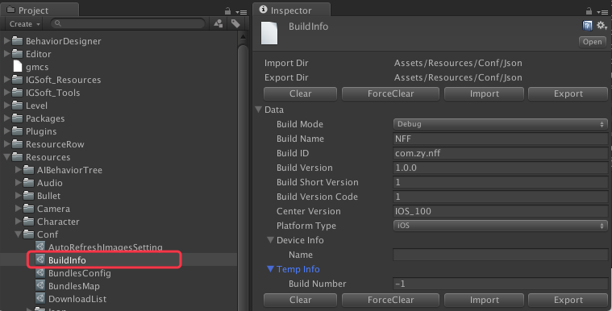

# 概述

--------------------------------

## 目录

1.[打包信息设定文件](BuildInfo.md#1%E6%89%93%E5%8C%85%E4%BF%A1%E6%81%AF%E8%AE%BE%E5%AE%9A%E6%96%87%E4%BB%B6)

1.1.[打包信息项目说明](BuildInfo.md#11%E6%89%93%E5%8C%85%E4%BF%A1%E6%81%AF%E9%A1%B9%E7%9B%AE%E8%AF%B4%E6%98%8E)

--------------------------------

### 1.打包信息设定文件

[返回目录](README.md#%E7%9B%AE%E5%BD%95)

`设定文件名：`BuildInfo.asset

`保存路径：`Assets/Resources/Conf/

`数据导入/导出：`Assets/Resources/Conf/Json

`详细见 图 1-1`
`图 1-1`

### 1.1.打包信息项目说明

[返回目录](README.md#%E7%9B%AE%E5%BD%95)

打包信息项目说明`详见: 表 1-1-1`

`表 1-1-1 打包信息项目说明`

| 项目名 | 说明 | 备注 |
|:------|:----|:-----|
| <B>ImportDir</B> | 数据导入目录 | * 一般情况下，均为`Assets/Resources/Conf/Json`。个别设定，`有所差异`。 * 导入/导出文件均为`Json`格式 |
| <B>ExportDir</B> | 数据导出目录 | * 一般情况下，均为`Assets/Resources/Conf/Json`。个别设定，`有所差异`。  * 导入/导出文件均为`Json`格式 |
| <B>顶部/底部功能按钮条</B> | 默认按钮有  1.清空  2.强制清空   3.导入  4.导出 | 个别设定，功能按钮条会`有所差异`   * 清空：单纯清空当前设定文件数据。  * 强制清空：不仅仅清空当前设定文件数据， `连导入／导出的Json文件也会清空`。  * 导入：从Json文件重新把数据导入。  * 导出：将设定文件的数据导出到Json文件 |
| <B>BuildMode</B> | 打包模式 | 打包模式分为   Debug : 开发用   Release : 发布用   Store : App Store模式（保留项目） |
| <B>BuildName</B> | 并非在手机安装完App后，在手机上显示的名字 该名字与上传／下载URL生成相关。 |
| <B>BuildID</B> | 打包ID。| 打包后,与iOS／Android下，app的签名相关   如：`com.zy.xxxx` |
| <B>BuildVersion</B> | 打包版本号 | 该版本号会影响到具体上传／下载资源的相对路径   `上传路径设定参看:`[上传路径说明]()   `下载路径设定参看:`[下载路径说明]() |
| <B>BuildShortVersion</B> | 版本短号 | 用于大版本下，小版本修正区分用   如：Bug修正，资源更新等等 |
| <B>BuildVersionCode</B> | 版本Code | 用于程序内部，版本索引，控制等状况下使用。 |
| <B>CenterVersion</B> | 中心版本号 | 用于向中心服务器拉取当前游戏服务器列表用 |
| <B>PlatformType</B> | 平台类型 | 平台类型如下：  None:无   iOS:iOS   iOS_Tiange:iOS天鸽版   Android:安卓纯净   Huawei:华为   Android_Tiange:安卓天鸽 |
| <B>DeviceInfo</B> | 硬件设备信息 | 保留字段 |
| <B>TempInfo</B> | 临时信息 | 保留字段 |