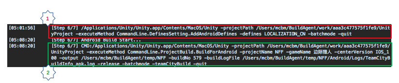
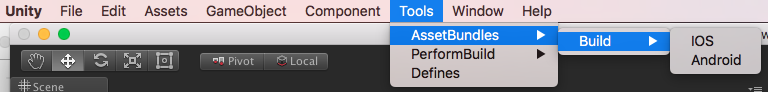
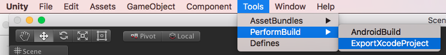
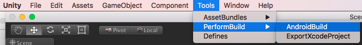

# 概述

--------------------------------

## 目录

99.[命令行](CommandLine.md#99%E5%91%BD%E4%BB%A4%E8%A1%8C)

99.1.[CI设定](CommandLine.md#991ci%E8%AE%BE%E5%AE%9A)

99.1.1.[TeamCity](CommandLine.md#9911teamcity)

99.2.[宏设定](CommandLine.md#992%E5%AE%8F%E8%AE%BE%E5%AE%9A)

99.3.[AssetBundle打包](CommandLine.md#993assetbundle%E6%89%93%E5%8C%85)

99.3.1.[手动打包AssetBundle](CommandLine.md#9931%E6%89%8B%E5%8A%A8%E6%89%93%E5%8C%85assetbundle)

99.3.2.[命令行打包AssetBundle](CommandLine.md#9932%E5%91%BD%E4%BB%A4%E8%A1%8C%E6%89%93%E5%8C%85assetbundle)

99.4.[App打包](CommandLine.md#994app%E6%89%93%E5%8C%85)

99.4.1.[App文件命名](CommandLine.md#9941app%E6%96%87%E4%BB%B6%E5%91%BD%E5%90%8D)

99.4.2.[iOS打包](CommandLine.md#9942ios%E6%89%93%E5%8C%85)

99.4.2.1.[手动打包iOS](CommandLine.md#99421%E6%89%8B%E5%8A%A8%E6%89%93%E5%8C%85ios)

99.4.2.2.[命令行打包iOS](CommandLine.md#99422%E5%91%BD%E4%BB%A4%E8%A1%8C%E6%89%93%E5%8C%85ios)

99.4.2.2.1.[导出Xcode工程](CommandLine.md#994221%E5%AF%BC%E5%87%BAxcode%E5%B7%A5%E7%A8%8B)

99.4.2.2.2.[导出ipa文件](CommandLine.md#994222%E5%AF%BC%E5%87%BAipa%E6%96%87%E4%BB%B6)

99.4.3.[Android打包](CommandLine.md#9943android%E6%89%93%E5%8C%85)

99.4.3.1.[手动打包Android](CommandLine.md#99431%E6%89%8B%E5%8A%A8%E6%89%93%E5%8C%85android)

99.4.3.2.[命令行打包Android](CommandLine.md#99432%E5%91%BD%E4%BB%A4%E8%A1%8C%E6%89%93%E5%8C%85android)

--------------------------------

## 99.命令行

[返回目录](README.md#%E7%9B%AE%E5%BD%95)

命令行的执行，支持外围参数指定。支持的参数列表`详见 表 99-1`。

`详见 表 99-1 命令行参数定义表`

| 参数名 | 格式 | 说明 | 备注 |
|:------|:-----|:----|:----|
| <B>OutputDir</B> | 打包输出目录 | -output `[Dir]` | - |
| <B>ProjectName</B> | 工程名 | -projectName `[name]` | * 在运行命令行时，如果有指定该参数，  则外部指定的工程名优先的原则下，  打包信息中的`BuildName`也会被此工程名置换。  * `详见`:[1.1.打包信息项目说明](BuildInfo.md#11%E6%89%93%E5%8C%85%E4%BF%A1%E6%81%AF%E9%A1%B9%E7%9B%AE%E8%AF%B4%E6%98%8E) |
| <B>GameName</B> | 游戏名 | -gameName `[name]` | * 这个名字是，用户安装完App后，  在手机上看到的名字。  * 若该参数有指定的话，显示指定的名字， 若无指定则显示`BuildName`   * `BuildName详见`:[1.1.打包信息项目说明](BuildInfo.md#11%E6%89%93%E5%8C%85%E4%BF%A1%E6%81%AF%E9%A1%B9%E7%9B%AE%E8%AF%B4%E6%98%8E) |
| <B>BuildId</B> | 打包ID | -buildId `[ID]` | * 该名字与App的签名有关，  一般格式为`com.zy.xxxx`   * 若该参数有指定的话，则置换打包信息中的`BuildID`。 若无指定，则将打包信息中设定的`BuildID`，作为打包用的`bundleIdentifier`  * `BuildID详见`:[1.1.打包信息项目说明](BuildInfo.md#11%E6%89%93%E5%8C%85%E4%BF%A1%E6%81%AF%E9%A1%B9%E7%9B%AE%E8%AF%B4%E6%98%8E) |
| <B>BuildVersion</B> | 打包版本号 | -buildVersion `[version]` | * 若该参数有指定的话，则置换打包信息中的`BuildVersion`。 若无指定，则将打包信息中设定的`BuildVersion`  * `BuildVersion详见`:[1.1.打包信息项目说明](BuildInfo.md#11%E6%89%93%E5%8C%85%E4%BF%A1%E6%81%AF%E9%A1%B9%E7%9B%AE%E8%AF%B4%E6%98%8E) |
| <B>BuildVersionCode</B> | 版本Code | -buildVersionCode `[versionCode]` | 保留字段 | - |
| <B>CenterVersion</B> | 中心版本号 | -centerVersion `[version]` | * 该参数与App启动时， 向中心服务器拉去服务器列表相关。   * 若该参数有指定的话，则置换打包信息中的`CenterVersion`。 若无指定，则将打包信息中设定的`CenterVersion`  * `CenterVersion详见`:[1.1.打包信息项目说明](BuildInfo.md#11%E6%89%93%E5%8C%85%E4%BF%A1%E6%81%AF%E9%A1%B9%E7%9B%AE%E8%AF%B4%E6%98%8E) |
| <B>PlatformType</B> | 平台类型 | -Huawei : 华为。| * `目前只支持华为`   * 若该参数有指定的话，则置换打包信息中的`PlatformType`。 若无指定，则将打包信息中设定的`PlatformType`  * `PlatformType详见`:[1.1.打包信息项目说明](BuildInfo.md#11%E6%89%93%E5%8C%85%E4%BF%A1%E6%81%AF%E9%A1%B9%E7%9B%AE%E8%AF%B4%E6%98%8E) |
| <B>BuildNumber</B> | 打包No | -buildNo `[Number]` | * 打包出来的ipa／apk文件名命名时用   * `TeamCity`上打包时，为TeamCity的`打包队列号`。  `本地打包`时为`-1`   * 打包文件名命名规则，`详见`:[99.4.1.App文件命名](CommandLine.md#9941app%E6%96%87%E4%BB%B6%E5%91%BD%E5%90%8D) |
| <B>BuildMode</B> | 打包模式 | `-debug` : Debug   `-release` : Release   `-store` : AppStore | -debug : `开发测试时用`   -release : `发行上架时用`   -store : `保留`|
| <B>Defines</B> | 宏指定 | -define `[agr2,arg2,arg3,...]` | * 允许复数指定，用`逗号`分隔   * 指定后的宏，运行&应用`详见`:[99.2.宏设定](CommandLine.md#992%E5%AE%8F%E8%AE%BE%E5%AE%9A) |
| <B>IsBuildInCI</B> | CI打包标志位 | `-teamCityBuild` : TeamCity打包 | * 暂时用于Log输出用 | 
| <B>IsCheatMode</B> | Cheat模式标志位 | `-cheat` : Cheat模式 | * 指定为Cheat模式时，  可允许控制台输出Debug命令。  * `为了方便测试而追加` | 
| <B>IsSkipDownload</B> | 跳过下载标志位 | `-skipDownload` : 跳过下载 | * 跳过下载时，游戏启动加载资源均为本地的资源。  `注意`:务必确保本地资源完整   * 若该参数有指定的话，则置换服务器设定中的`SkipDownload`。 若无指定，则将使用服务器设定中的`SkipDownload`  * `PlatformType详见`:[2.1.共通设定](Servers.md#21%E5%85%B1%E9%80%9A%E8%AE%BE%E5%AE%9A) | 
| <B>BuildTime</B> | 打包时间 | -buildTime `[BuildTime]` | * 打包时间格式:`YYYYMMDDHHMMSS`。  * 若未指定，则取当前系统时间   * 打包出来的ipa／apk文件名命名时用   * 打包文件名命名规则，`详见`:[99.4.1.App文件命名](CommandLine.md#9941app%E6%96%87%E4%BB%B6%E5%91%BD%E5%90%8D) | 
| <B>BuildLogFile</B> | 打包Log文件 | -buildLogFile `[xxxx.log]` | * 打包日志文件指定。 |

### 99.1.CI设定

[返回目录](README.md#%E7%9B%AE%E5%BD%95)

#### 99.1.1.TeamCity

[返回目录](README.md#%E7%9B%AE%E5%BD%95)

### 99.2.宏设定

[返回目录](README.md#%E7%9B%AE%E5%BD%95)

可以经过上述`表 99-1 命令行参数定义表`中  `Defines`的描述，在运行打包命令之前，指定当前开放的有效宏

`注意`:为了让通过命令行指定的宏对工程有效，宏指定的命令行，比如与打包的ipa/apk的命令行`分两次执行`。

如`图 99-2-1`

`图 99-2-1 命令行执行示例`

* 1) 自定义宏设定命令行
* 2) 进行apk打包

`命令行格式`:

> [Unity安装路径] `-projectPath` [工程路径] `-executeMethod` CommandLine.DefinesSetting.AddIOSDefines `-defines` [指定宏列表] `-batchmode` `-quit`

宏设定命令行项目说明`详见: 表 99-2-1`

`表 99-2-1 宏设定命令行项目说明`

| 项目名 | 说明 | 备注 |
|:------|:-----|:----|
| <B>Unity安装路径</B> | Unity安装路径 | * 如：`/Applications/Unity/Unity.app/Contents/MacOS/Unity` |
| <B>-projectPath</B> | 项目工程路径 | - |
| <B>-executeMethod</B> | 执行方法 | * 固定:`CommandLine.DefinesSetting.AddIOSDefines` |
| <B>-defines</B> | 指定宏(允许复数) | * `详见`:[99.命令行](CommandLine.md#99%E5%91%BD%E4%BB%A4%E8%A1%8C)`Defines` |
| <B>-batchmode</B> | 在后台运行 | - |
| <B>-quit</B> | 运行完，自动退出Unity | - |

### 99.3.AssetBundle打包

[返回目录](README.md#%E7%9B%AE%E5%BD%95)

资源打包分`手动模式`和`命令行模式`

### 99.3.1.手动打包AssetBundle

[返回目录](README.md#%E7%9B%AE%E5%BD%95)

手动打包方式可以通过以下操作进行打包

* iOS

> `Menu` -> `Tools` -> `AssetBundles` -> `Build` -> `iOS`

* Android

> `Menu` -> `Tools` -> `AssetBundles` -> `Build` -> `Android`

如`图 99-3-1-1`

`图 99-3-1-1 手动打包AssetBundle`

`注意：`

* 打包设定信息`详见`:3.[资源打包](AssetBundle.md#3%E8%B5%84%E6%BA%90%E6%89%93%E5%8C%85)

* 打包成功后，将自动生成资源上传脚本`Upload.sh`。`详见`4.1.[上传脚本设定](Upload.md#41%E4%B8%8A%E4%BC%A0%E8%84%9A%E6%9C%AC%E8%AE%BE%E5%AE%9A)

* 打包生成的资源将存放在当前工程下的`StreamingAssets`目录下，但是一旦运行了上传脚本`Upload.sh`，在上传成功后，当前目录下的文件将都会被`清空`。

### 99.3.2.命令行打包AssetBundle

[返回目录](README.md#%E7%9B%AE%E5%BD%95)

`暂不支持命令行模式`

### 99.4.App打包

[返回目录](README.md#%E7%9B%AE%E5%BD%95)

#### 99.4.1.App文件命名

[返回目录](README.md#%E7%9B%AE%E5%BD%95)

`文件名命名格式`:

> [工程名]\_[打包模式]\_[App版本号]\_[BuildNumber]\_[BuildTime].[文件后缀]

App文件命名项目说明`详见: 表 99-4-1-1`

`表 99-4-1-1 App文件命名项目说明`

| 项目名 | 说明 | 备注 |
|:------|:-----|:----|
| <B>工程名</B> | 工程名 | * App的工程名   * `详见：`[99.命令行](CommandLine.md#99%E5%91%BD%E4%BB%A4%E8%A1%8C)`ProjectName` |
| <B>打包模式</B> | 打包模式 | * `详见：`[99.命令行](CommandLine.md#99%E5%91%BD%E4%BB%A4%E8%A1%8C)`BuildMode` |
| <B>App版本号</B> | 当前App版本号 | * `详见：`[99.命令行](CommandLine.md#99%E5%91%BD%E4%BB%A4%E8%A1%8C)`BuildVersion` |
| <B>BuildNumber</B> | 打包No | * `详见：`[99.命令行](CommandLine.md#99%E5%91%BD%E4%BB%A4%E8%A1%8C)`BuildNumber` |
| <B>BuildTime</B> | 打包时间 | * `详见：`[99.命令行](CommandLine.md#99%E5%91%BD%E4%BB%A4%E8%A1%8C)`BuildTime` |
| <B>文件后缀</B> | ipa/apk文件后缀名 | * iOS:`.ipa`   * Android:`.apk` |

如：
> XXXXX_Debug_v1.0.0_1_20171130171239.apk
> 
> * `工程名`:XXXXX
> * `打包模式`:Debug
> * `App版本号`:v1.0.0
> * `BuildNumber`:1
> * `BuildTime`:20171130171239

#### 99.4.2.iOS打包

[返回目录](README.md#%E7%9B%AE%E5%BD%95)

Unity的iOS打包，要`借助Xcode`。Unity只是把工程导出成XCode工程，`借助Xcode工程`，在打包成ipa文件。

导出Xcode工程也分，[99.4.2.1.手动打包iOS](CommandLine.md#99421%E6%89%8B%E5%8A%A8%E6%89%93%E5%8C%85ios)和[99.4.2.2.命令行打包iOS](CommandLine.md#99422%E5%91%BD%E4%BB%A4%E8%A1%8C%E6%89%93%E5%8C%85ios)

为了导出XCode工程后，能直接编译成想要的ipa，针对导出的Xcode工程进行一些设定。
设定`详见`:[9.XCode导出设定](XcodeSettings.md#9xcode%E5%AF%BC%E5%87%BA%E8%AE%BE%E5%AE%9A)

##### 99.4.2.1.手动打包iOS

[返回目录](README.md#%E7%9B%AE%E5%BD%95)

手动打包方式可以通过以下操作进行打包

> `Menu` -> `Tools` -> `PerformBuild` -> `ExportXcodeProject`

如`图 99-4-2-1-1`

`图 99-4-2-1-1 手动打包iOS`

`注意`:

* 导出文件目录:`[当前工程根目录]/Output/iOS/XcodeProject`
* 导出Xcode工程后，需手动`编译`或者导出`ipa文件`。这里就不赘述了。

##### 99.4.2.2.命令行打包iOS

[返回目录](README.md#%E7%9B%AE%E5%BD%95)

命令行打包iOS分两步
* `导出Xcode工程`
    - `详见`:[99.4.2.2.1.导出Xcode工程]()
* `导出ipa文件`
    - `详见`:[99.4.2.2.2.导出ipa文件]()

命令行打包，是通过CI工具进行打包的。如:`TeamCity`。

`详见`:[99.1.CI设定](CommandLine.md#991ci%E8%AE%BE%E5%AE%9A)

###### 99.4.2.2.1.导出Xcode工程

[返回目录](README.md#%E7%9B%AE%E5%BD%95)

`命令行格式`:

> [Unity安装路径] -projectPath [工程路径] -executeMethod CommandLine.ProjectBuild.ExportXcodeProject -projectName [工程名] -gameName [游戏名] -centerVersion [中心版本号] -output [输出路径] -buildNo [BuildNumber] -buildLogFile [打包日志输出] -release -batchmode -teamCityBuild -quit

命令行打导出Xcode工程`详见: 表 99-4-2-2-1-1`

`表 99-4-2-2-1-1 命令行打导出Xcode工程`

| 项目名 | 说明 | 备注 |
|:------|:-----|:----|
| <B>Unity安装路径</B> | Unity安装路径 | * 如：`/Applications/Unity/Unity.app/Contents/MacOS/Unity` |
| <B>-projectPath</B> | 项目工程路径 | - |
| <B>-executeMethod</B> | 执行方法 | * 固定:`CommandLine.ProjectBuild.ExportXcodeProject` |
| <B>-gameName</B> | 游戏名 | * `详见`:[99.命令行](CommandLine.md#99%E5%91%BD%E4%BB%A4%E8%A1%8C)`GameName` |
| <B>-centerVersion</B> | 中心版本号 | * `详见`:[99.命令行](CommandLine.md#99%E5%91%BD%E4%BB%A4%E8%A1%8C)`CenterVersion` |
| <B>-output</B> | 打包输出目录 | * `详见`:[99.命令行](CommandLine.md#99%E5%91%BD%E4%BB%A4%E8%A1%8C)`OutputDir` |
| <B>-buildNo</B> | 打包No | * `详见`:[99.命令行](CommandLine.md#99%E5%91%BD%E4%BB%A4%E8%A1%8C)`BuildNumber` |
| <B>-buildLogFile</B> | 打包日志文件 | * `详见`:[99.命令行](CommandLine.md#99%E5%91%BD%E4%BB%A4%E8%A1%8C)`BuildLogFile` |
| <B>-release</B> | 打包模式：`Debug/Release/Store` | * `详见`:[99.命令行](CommandLine.md#99%E5%91%BD%E4%BB%A4%E8%A1%8C)`BuildMode` |
| <B>-batchmode</B> | 在后台运行 | - |
| <B>-teamCityBuild</B> | CI打包标识位置 | * `详见`:[99.命令行](CommandLine.md#99%E5%91%BD%E4%BB%A4%E8%A1%8C)`IsBuildInCI` |
| <B>-quit</B> | 运行完，自动退出Unity | - |

`可选参数`

| 项目名 | 说明 | 备注 |
|:------|:-----|:----|
| <B>-cheat</B> | 开启Cheat模式 | * `详见`:[99.命令行](CommandLine.md#99%E5%91%BD%E4%BB%A4%E8%A1%8C)`IsCheatMode` |
| <B>-skipDownload</B> | 跳过下载 | * `详见`:[99.命令行](CommandLine.md#99%E5%91%BD%E4%BB%A4%E8%A1%8C)`IsSkipDownload` |
| <B>-buildTime</B> | 打包时间 | * `详见`:[99.命令行](CommandLine.md#99%E5%91%BD%E4%BB%A4%E8%A1%8C)`BuildTime` |

###### 99.4.2.2.2.导出ipa文件

[返回目录](README.md#%E7%9B%AE%E5%BD%95)

导出ipa文件需要先导出`xcarchive文件`,然后在导出`ipa文件`

* `导出xcarchive文件`

`命令行格式`:

> xcodebuild -configuration [打包模式] archive -archivePath [xcarchive文件输出路径] -scheme Unity-iPhone

| 项目名 | 说明 | 备注 |
|:------|:-----|:----|
| <B>xcodebuild</B> | xcode打包命令 | - |
| <B>-configuration</B> | 设定打包模式 | * 打包模式:`Debug/Release/Store`   * `详见`:[99.命令行](CommandLine.md#99%E5%91%BD%E4%BB%A4%E8%A1%8C)`BuildMode` |
| <B>-archivePath</B> | 导出xcarchive | * 导出`xcarchive`文件后，可以用来进一步导出`ipa`文件 |
| <B>-scheme</B> | - | `Unity-iPhone`:Unity导出的工程改名字均为固定 |

* `导出ipa文件`

> xcodebuild -exportArchive -archivePath [xcarchive文件输出路径] -exportOptionsPlist [导出用的Plist文件] -exportPath [ipa导出目录]

| 项目名 | 说明 | 备注 |
|:------|:-----|:----|
| <B>xcodebuild</B> | xcode打包命令 | - |
| <B>-exportArchive</B> | 导出Archive | - |
| <B>-archivePath</B> | 导出xcarchive | * 导出`xcarchive`文件后，可以用来进一步导出`ipa`文件 |
| <B>-exportOptionsPlist</B> | 导出ipa用 | * Xcode9.0+以后，ipa的导出需要指定导出用的plist文件
* 详细的可以查阅苹果官方文档 |
| <B>-exportPath</B> | ipa导出目录 | - |

##### 99.4.3.Android打包

[返回目录](README.md#%E7%9B%AE%E5%BD%95)

Android打包同样分为[99.4.3.1.手动打包Android](CommandLine.md#99431%E6%89%8B%E5%8A%A8%E6%89%93%E5%8C%85android)和[99.4.3.2.命令行打包Android](CommandLine.md#99432%E5%91%BD%E4%BB%A4%E8%A1%8C%E6%89%93%E5%8C%85android)

`注意`:

* Android下，因为存在的平台众多，所以难免，会针对各个平台自己的接口进行设置。一般为导出自定义的\*.Jar架包。然后导入Unity工程，在进行打包。Unity会对相应的架包进行处理。`详见`:[8.AndroidSDK](AndroidSDK.md#8androidsdk) 

###### 99.4.3.1.手动打包Android

[返回目录](README.md#%E7%9B%AE%E5%BD%95)

手动打包方式可以通过以下操作进行打包

> `Menu` -> `Tools` -> `PerformBuild` -> `AndroidBuild`

如`图 99-4-3-1-1`

`图 99-4-3-1-1 手动打包Android`

`注意`:

* 导出文件命名`详见`:[99.4.1.App文件命名](CommandLine.md#9941app%E6%96%87%E4%BB%B6%E5%91%BD%E5%90%8D)
* 导出文件目录:`[当前工程根目录]/Output/Android/`

###### 99.4.3.2.命令行打包Android

[返回目录](README.md#%E7%9B%AE%E5%BD%95)

命令行打包，是通过CI工具进行打包的。如:`TeamCity`。

`详见`:[99.1.CI设定](CommandLine.md#991ci%E8%AE%BE%E5%AE%9A)

`命令行格式`:

> [Unity安装路径] -projectPath [工程路径] -executeMethod CommandLine.ProjectBuild.BuildForAndroid -projectName [工程名] -gameName [游戏名] -centerVersion [中心版本号] -output [输出路径] -buildNo [BuildNumber] -buildLogFile [打包日志输出] -release -batchmode -teamCityBuild -quit

命令行打包Android项目说明`详见: 表 99-4-3-2-1`

`表 99-4-3-2-1 命令行打包Android项目说明`

| 项目名 | 说明 | 备注 |
|:------|:-----|:----|
| <B>Unity安装路径</B> | Unity安装路径 | * 如：`/Applications/Unity/Unity.app/Contents/MacOS/Unity` |
| <B>-projectPath</B> | 项目工程路径 | - |
| <B>-executeMethod</B> | 执行方法 | * 固定:`CommandLine.ProjectBuild.BuildForAndroid` |
| <B>-gameName</B> | 游戏名 | * `详见`:[99.命令行](CommandLine.md#99%E5%91%BD%E4%BB%A4%E8%A1%8C)`GameName` |
| <B>-centerVersion</B> | 中心版本号 | * `详见`:[99.命令行](CommandLine.md#99%E5%91%BD%E4%BB%A4%E8%A1%8C)`CenterVersion` |
| <B>-output</B> | 打包输出目录 | * `详见`:[99.命令行](CommandLine.md#99%E5%91%BD%E4%BB%A4%E8%A1%8C)`OutputDir` |
| <B>-buildNo</B> | 打包No | * `详见`:[99.命令行](CommandLine.md#99%E5%91%BD%E4%BB%A4%E8%A1%8C)`BuildNumber` |
| <B>-buildLogFile</B> | 打包日志文件 | * `详见`:[99.命令行](CommandLine.md#99%E5%91%BD%E4%BB%A4%E8%A1%8C)`BuildLogFile` |
| <B>-release</B> | 打包模式：`Debug/Release/Store` | * `详见`:[99.命令行](CommandLine.md#99%E5%91%BD%E4%BB%A4%E8%A1%8C)`BuildMode` |
| <B>-batchmode</B> | 在后台运行 | - |
| <B>-teamCityBuild</B> | CI打包标识位置 | * `详见`:[99.命令行](CommandLine.md#99%E5%91%BD%E4%BB%A4%E8%A1%8C)`IsBuildInCI` |
| <B>-quit</B> | 运行完，自动退出Unity | - |

`可选参数`

| 项目名 | 说明 | 备注 |
|:------|:-----|:----|
| <B>-cheat</B> | 开启Cheat模式 | * `详见`:[99.命令行](CommandLine.md#99%E5%91%BD%E4%BB%A4%E8%A1%8C)`IsCheatMode` |
| <B>-skipDownload</B> | 跳过下载 | * `详见`:[99.命令行](CommandLine.md#99%E5%91%BD%E4%BB%A4%E8%A1%8C)`IsSkipDownload` |
| <B>-buildTime</B> | 打包时间 | * `详见`:[99.命令行](CommandLine.md#99%E5%91%BD%E4%BB%A4%E8%A1%8C)`BuildTime` |