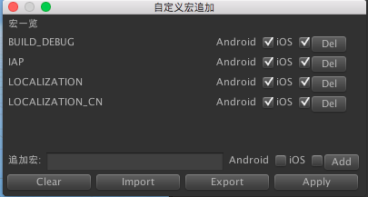

# 概述

--------------------------------

## 目录

7.[宏](Defines.md#7%E5%AE%8F)

--------------------------------

## 7.宏

[返回目录](README.md#%E7%9B%AE%E5%BD%95)

宏追加，可以通过以下操作，打开宏设定窗口。

`Menu` -> `Tools` -> `Defines`

`详见：图 7-1`

`图 7-1 宏设定窗口`

`说明事项`

> * 目前宏的追加，设定，删除只支持`iOS`和`Android`。
> * 追加宏后，要使其生效，则必须`Apply`
> * 宏的设定信息，可以`导入`与`导出`
> * 若是运用CI打包ipa/apk文件时，要想让外部指定的宏命令有效，则必须执行命令行。
>     - 命令行的执行`详见`:[99.2.宏设定](CommandLine.md#992%E5%AE%8F%E8%AE%BE%E5%AE%9A)