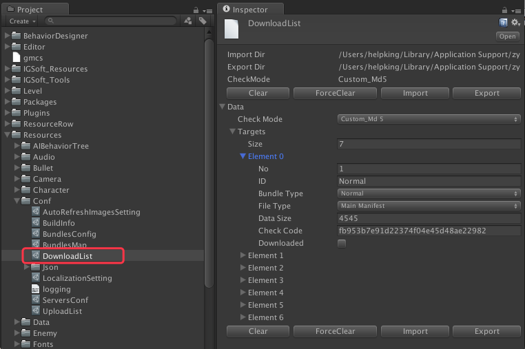

# 概述

--------------------------------

## 目录

5.[下载](Download.md#5%E4%B8%8B%E8%BD%BD)

5.1.[下载列表](Download.md#51%E4%B8%8B%E8%BD%BD%E5%88%97%E8%A1%A8)

5.1.1.[下载列表项目说明](Download.md#511%E4%B8%8B%E8%BD%BD%E5%88%97%E8%A1%A8%E9%A1%B9%E7%9B%AE%E8%AF%B4%E6%98%8E)

5.1.2.[下载目标项目说明](Download.md#512%E4%B8%8B%E8%BD%BD%E7%9B%AE%E6%A0%87%E9%A1%B9%E7%9B%AE%E8%AF%B4%E6%98%8E)

5.2.[下载URL设定](Download.md#52%E4%B8%8B%E8%BD%BDurl%E8%AE%BE%E5%AE%9A)

5.2.1.[下载URL项目说明](Download.md#521%E4%B8%8B%E8%BD%BDurl%E9%A1%B9%E7%9B%AE%E8%AF%B4%E6%98%8E)

--------------------------------

## 5.下载

[返回目录](README.md#%E7%9B%AE%E5%BD%95)

### 5.1.下载列表

[返回目录](README.md#%E7%9B%AE%E5%BD%95)

`设定文件名：`DownloadList.asset

`保存路径：`Assets/Resources/Conf/`

`数据导入/导出`:`Application.persistentDataPath`/Bundles

`详见：图 5-1-1`

`图 5-1-1 下载列表文件`

#### 5.1.1.下载列表项目说明

[返回目录](README.md#%E7%9B%AE%E5%BD%95)

上传列表项目说明`详见: 表 5-1-1-1`

`表 5-1-1-1 下载列表项目说明`

| 项目名 | 说明 | 备注 |
|:------|:----|:-----|
| <B>ImportDir</B> | 数据导入目录 | * 导入目录：`Application.persistentDataPath`/Bundles   为了保证下载数据前后一致性，App在启动时，会先从Unity3d指定的数据永久存储目录下，导入已有的下载记录。 |
| <B>ExportDir</B> | 数据导出目录 | * 导入目录：`Application.persistentDataPath`/Bundles   为了保证下载数据前后一致性，在下载完毕时，会导出一次现在的下载记录到Unity3d指定的数据永久存储目录下。 |
| <B>顶部/底部功能按钮条</B> | 默认按钮有  1.清空  2.强制清空   3.导入  4.导出 | 个别设定，功能按钮条会`有所差异`   * 清空：单纯清空当前设定文件数据。  * 强制清空：不仅仅清空当前设定文件数据， `连导入／导出的Json文件也会清空。若想重新下载一边，可以强制清空一次。`  * 导入：从Json文件重新把数据导入。  * 导出：将设定文件的数据导出到Json文件 |
| <B>CheckMode</B> | 数据校验模式 | 数据校验模式，与`上传`前，数据校验模式`必须保持一致`。  * `详见`:[4.2.1.上传列表项目说明](Upload.md#421%E4%B8%8A%E4%BC%A0%E5%88%97%E8%A1%A8%E9%A1%B9%E7%9B%AE%E8%AF%B4%E6%98%8E) |
| <B>Targets</B> | 下载目标列表 |  * `详见`:[5.1.2.下载目标项目说明]() |

#### 5.1.2.下载目标项目说明

[返回目录](README.md#%E7%9B%AE%E5%BD%95)

上传列表项目说明`详见: 表 5-1-2-1`

`表 5-1-2-1 下载目标项目说明`

| 项目名 | 说明 | 备注 |
|:------|:----|:-----|
| No | No | * 下载以此No升顺，下载。  * 继承自Uploadlist。`本身自己不计数`   * `详见`:[4.2.2.上传目标项目说明](Upload.md#422%E4%B8%8A%E4%BC%A0%E7%9B%AE%E6%A0%87%E9%A1%B9%E7%9B%AE%E8%AF%B4%E6%98%8E) |
| ID | 资源包ID | * 继承自Uploadlist。`本身不生成`   * `详见`:[4.2.2.上传目标项目说明](Upload.md#422%E4%B8%8A%E4%BC%A0%E7%9B%AE%E6%A0%87%E9%A1%B9%E7%9B%AE%E8%AF%B4%E6%98%8E) |
| BundleType | 资源类型 | * 继承自Uploadlist。`本身不生成`   * `详见`:[4.2.2.上传目标项目说明](Upload.md#422%E4%B8%8A%E4%BC%A0%E7%9B%AE%E6%A0%87%E9%A1%B9%E7%9B%AE%E8%AF%B4%E6%98%8E) |
| FileType | 文件类型 | * 继承自Uploadlist。`本身不生成`   * `详见`:[4.2.2.上传目标项目说明](Upload.md#422%E4%B8%8A%E4%BC%A0%E7%9B%AE%E6%A0%87%E9%A1%B9%E7%9B%AE%E8%AF%B4%E6%98%8E) |
| DataSize | 数据大小 | * 用于计算下载进度用   * 继承自Uploadlist。`本身不生成`   * `详见`:[4.2.2.上传目标项目说明](Upload.md#422%E4%B8%8A%E4%BC%A0%E7%9B%AE%E6%A0%87%E9%A1%B9%E7%9B%AE%E8%AF%B4%E6%98%8E) |
| CheckCode | 校验Code | * 继承自Uploadlist。`本身不生成`   * `详见`:[4.2.2.上传目标项目说明](Upload.md#422%E4%B8%8A%E4%BC%A0%E7%9B%AE%E6%A0%87%E9%A1%B9%E7%9B%AE%E8%AF%B4%E6%98%8E)   * 文件下载完毕时，用该Code进行校验。  * 如果校验失败，会重新下载。（重试次数上限：`详见`:[2.1.共通设定](Servers.md#21%E5%85%B1%E9%80%9A%E8%AE%BE%E5%AE%9A)）|
| Downloaded | 下载完成标志位 | 下载完成后，该标识为会被置`true` |

### 5.2.下载URL设定

[返回目录](README.md#%E7%9B%AE%E5%BD%95)

下载采用Http方式进行下载。下载使用`子线程`。

* 子线程`上限数`，`重试数`，以及`超时`设置。`详见`:[2.1.共通设定](Servers.md#21%E5%85%B1%E9%80%9A%E8%AE%BE%E5%AE%9A)

`下载URL`设置如下：

* 资源包文件

<pre><code>
    http://[下载URL]/[工程名]/bundles/[平台类型]/[App版本号]/[BundleType]/[资源包ID].[文件后缀名]
</code></pre>

* Manifest文件

<pre><code>
    http://[下载URL]/[工程名]/bundles/[平台类型]/[App版本号]/[BundleType]/[资源包ID].[文件后缀名].manifest
</code></pre>

`例如：`   

>  http://down.xxxx.com/UnityPlugins/bundles/iOS/1.0.0/Normal/assets_resources_texture_.Unity3d

#### 5.2.1.下载URL项目说明

[返回目录](README.md#%E7%9B%AE%E5%BD%95)

下载URL项目说明`详见：表 5-2-1-1`

`表 5-2-1-1 下载URL项目说明`

| 项目名 | 说明 | 备注 |
|:------|:----|:-----|
| 下载URL | 上传服务器IP地址 | `详见:`[2.3.下载服务器设定](Servers.md#23%E4%B8%8B%E8%BD%BD%E6%9C%8D%E5%8A%A1%E5%99%A8%E8%AE%BE%E5%AE%9A) |
| 工程名 | 当前工程名 | * 该工程名，与项目实际的工程无关。  * 而是在[2.2.上传服务器设定](Servers.md#22%E4%B8%8A%E4%BC%A0%E6%9C%8D%E5%8A%A1%E5%99%A8%E8%AE%BE%E5%AE%9A)时，该上传账号，相对于服务器上默认的登录路径相关。  * `所以该上传服务器账号设置，在登录服务器后，默认当前路径在工程根目录下。`  * 当然最好是更工程内部设定的打包名保持一致，一面混淆。`详见：`[1.1.打包信息项目说明](BuildInfo.md#11%E6%89%93%E5%8C%85%E4%BF%A1%E6%81%AF%E9%A1%B9%E7%9B%AE%E8%AF%B4%E6%98%8E) |
| bundles | Bundles固定目录 | - |
| 平台类型 | 平台类型 | 目前只支持：`iOS`和`Android` |
| App版本号 | App版本号 | * `详见:`[1.1.打包信息项目说明](BuildInfo.md#11%E6%89%93%E5%8C%85%E4%BF%A1%E6%81%AF%E9%A1%B9%E7%9B%AE%E8%AF%B4%E6%98%8E)   * 随着App版本的升级，资源实行版本分割管理。`所以每一次版本号变更，资源都需要重新打包上传。` |
| BundleType | 资源类型 | 资源类型分为：  `Normal`:一般资源（非场景资源）  `Scene`:场景资源 |
| 资源包ID | 资源打包ID | * `详见:`[3.2.2.资源设定说明](AssetBundle.md#322%E8%B5%84%E6%BA%90%E8%AE%BE%E5%AE%9A%E8%AF%B4%E6%98%8E) |
| 文件后缀名 | 文件后缀名 | * `详见:`[4.2.1.上传列表项目说明](Upload.md#421%E4%B8%8A%E4%BC%A0%E5%88%97%E8%A1%A8%E9%A1%B9%E7%9B%AE%E8%AF%B4%E6%98%8E) |