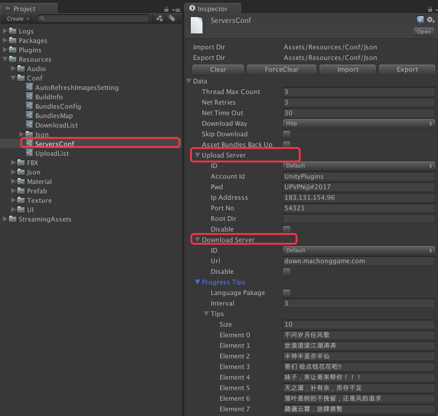
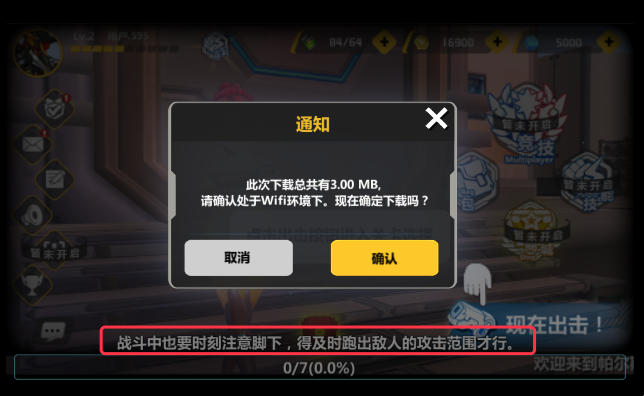

# 概述

--------------------------------

## 目录

2.[服务器设定](Servers.md#2%E6%9C%8D%E5%8A%A1%E5%99%A8%E8%AE%BE%E5%AE%9A)

2.1.[共通设定](Servers.md#21%E5%85%B1%E9%80%9A%E8%AE%BE%E5%AE%9A)

2.2.[上传服务器设定](Servers.md#22%E4%B8%8A%E4%BC%A0%E6%9C%8D%E5%8A%A1%E5%99%A8%E8%AE%BE%E5%AE%9A)

2.3.[下载服务器设定](Servers.md#23%E4%B8%8B%E8%BD%BD%E6%9C%8D%E5%8A%A1%E5%99%A8%E8%AE%BE%E5%AE%9A)

2.4.[进度条Tips](Servers.md#24%E8%BF%9B%E5%BA%A6%E6%9D%A1tips)

--------------------------------

## 2.服务器设定

[返回目录](README.md#%E7%9B%AE%E5%BD%95)

服务器设定分，上传服务器设定和下载服务器设定。根据运维的要求，资源服务器部署以及实际网络状况。上述设定可能上传服务器以及下载服务器可能会存在若干差异。这种情况只能具体问题具体分析。所以服务器设定中，将上传和下载进行了区分。`详见：图 2-1`

`图 2-1 服务器设定`

### 2.1.共通设定

[返回目录](README.md#%E7%9B%AE%E5%BD%95)

共通设定`详见: 表 2-1-1`

`共通设定中，有些严格意义上可能不应该属于服务器设定，暂时先放置在这里，以后会更改`

`表 2-1-1 服务器共通设定`

| 项目名 | 说明 | 备注 |
|:------|:----|:-----|
| <B>ImportDir</B> | 数据导入目录 | * 一般情况下，均为`Assets/Resources/Conf/Json`。个别设定，`有所差异`。 * 导入/导出文件均为`Json`格式 |
| <B>ExportDir</B> | 数据导出目录 | * 一般情况下，均为`Assets/Resources/Conf/Json`。个别设定，`有所差异`。  * 导入/导出文件均为`Json`格式 |
| <B>顶部/底部功能按钮条</B> | 默认按钮有  1.清空  2.强制清空   3.导入  4.导出 | 个别设定，功能按钮条会`有所差异`   * 清空：单纯清空当前设定文件数据。  * 强制清空：不仅仅清空当前设定文件数据， `连导入／导出的Json文件也会清空`。  * 导入：从Json文件重新把数据导入。  * 导出：将设定文件的数据导出到Json文件 |
| ThreadMaxCount | 线程最大上限数 | 允许同时产生的最大线程数。  `目前只在下载中进行限制。` |
| NewRetries | 网络重试数 | 通信失败后，允许重试上限数 |
| NetTimeOut | 网络超时时间 | - |
| DownloadWay | 下载方式 | 保留字段（目前暂时废弃，不用） |
| SkipDownload | 跳过下载 | `开发阶段使用。真正打包发布版本，不允许跳过` |
| AssetBundlesBackUp | 资源包本地备份标识为 | 保留字段（目前暂时废弃，不用） |

### 2.2.上传服务器设定

[返回目录](README.md#%E7%9B%AE%E5%BD%95)

上传服务器设定，只在Unity3d编辑器模式下有效。为了防止服务器信息暴露，实际打包成ipa/apk时，不包含相关信息。
具体项目`详见: 表 2-2-1`

`表 2-2-1 上传服务器设定`

| 项目名 | 说明 | 备注 |
|:------|:----|:-----|
| ID | ID | 保留字段（目前暂时废弃，不用）|
| AccountID | 账号 | FTP上传用。与[1.3.打包步骤](AssetBundle.md#13%E6%89%93%E5%8C%85%E6%AD%A5%E9%AA%A4)中，第4步，自动生成的上传脚本`Upload.sh`相关 |
| Pwd | 密码 | FTP上传用。与[1.3.打包步骤](AssetBundle.md#13%E6%89%93%E5%8C%85%E6%AD%A5%E9%AA%A4)中，第4步，自动生成的上传脚本`Upload.sh`相关 |
| IpAddress | 上传服务器IP地址 | FTP上传用。与[1.3.打包步骤](AssetBundle.md#13%E6%89%93%E5%8C%85%E6%AD%A5%E9%AA%A4)中，第4步，自动生成的上传脚本`Upload.sh`相关 |
| PortNo | 上传服务器端口号 | FTP上传用。与[1.3.打包步骤](AssetBundle.md#13%E6%89%93%E5%8C%85%E6%AD%A5%E9%AA%A4)中，第4步，自动生成的上传脚本`Upload.sh`相关 |
| RootDir | 上传根目录 | 保留字段（目前为`空`）|
| Disable | 无效标识位 | - |

### 2.3.下载服务器设定

[返回目录](README.md#%E7%9B%AE%E5%BD%95)

下载服务器设定项目`详见: 表 2-3-1`

`表 2-3-1 下载服务器设定`

| 项目名 | 说明 | 备注 |
|:------|:----|:-----|
| ID | ID | 保留字段（目前暂时废弃，不用）|
| Url | 下载URL | 为防止服务器地址暴露，与上传不同，下载采用URL方式下载 | 
| Disable | 无效标识位 | - |

### 2.4.进度条Tips

[返回目录](README.md#%E7%9B%AE%E5%BD%95)

在进度条更新或者下载的等待过程中，在进度条上方随机的显示一些跟游戏相关的趣味小提示。`详见：图 2-3-1`

`图 2-3-1 进度条Tips`

`项目说明详见 表 2-3-1`

`表 2-3-1 进度条Tips项目说明`

| 项目名 | 说明 | 备注 |
|:------|:----|:-----|
| LanguagePackage | 本地化语言包标识位 | - |
| Interval | 刷新时间间隔（单位：秒）| - |
| Tips | 趣味提示列表 | 本地化语言包标识位为True时，列表中记录的就都是本地化文字串的ID了 |
