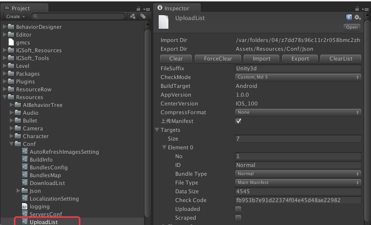

# 概述

--------------------------------

## 目录

4.[上传](Upload.md#4%E4%B8%8A%E4%BC%A0)

4.1.[上传脚本设定](Upload.md#41%E4%B8%8A%E4%BC%A0%E8%84%9A%E6%9C%AC%E8%AE%BE%E5%AE%9A)

4.2.[上传列表文件](Upload.md#42%E4%B8%8A%E4%BC%A0%E5%88%97%E8%A1%A8%E6%96%87%E4%BB%B6)

4.2.1.[上传列表项目说明](Upload.md#421%E4%B8%8A%E4%BC%A0%E5%88%97%E8%A1%A8%E9%A1%B9%E7%9B%AE%E8%AF%B4%E6%98%8E)

4.2.2.[上传目标项目说明](Upload.md#422%E4%B8%8A%E4%BC%A0%E7%9B%AE%E6%A0%87%E9%A1%B9%E7%9B%AE%E8%AF%B4%E6%98%8E)

4.2.3.[上传URL设定](Upload.md#423%E4%B8%8A%E4%BC%A0url%E8%AE%BE%E5%AE%9A)

4.2.3.1.[上传URL项目说明](Upload.md#4231%E4%B8%8A%E4%BC%A0url%E9%A1%B9%E7%9B%AE%E8%AF%B4%E6%98%8E)

--------------------------------
## 4.上传

[返回目录](README.md#%E7%9B%AE%E5%BD%95)

## 4.1.上传脚本设定

[返回目录](README.md#%E7%9B%AE%E5%BD%95)

打包后，将自动生成上传脚本`Upload.sh`。详细格式如下：

<pre><code>
#!/bin/bash

# 上传根目录
ROOT_DIR=bundles
# 本地上传路径
UPLOAD_FROM_ROOT_DIR=/.../Assets/StreamingAssets

# 上传目标平台
BUILD_TARGET=iOS
# App Version
APP_VERSION=1.0.0
# Center Version
CENTER_VERSION=

# 检测上传目录
# $1 上传目录
checkUploadDir()
{
    ...(检测上传目录)
}

# 文件上传函数
# $1 本地上传目录
# $2 上传目标目录
# $3 上传目标文件
upload()
{
    ...(上传文件)
}

# 检测目录
checkUploadDir (目录1)
...
checkUploadDir (目录2)

# 上传资源文件
# 检测一般文件目录
checkUploadDir $ROOT_DIR/$BUILD_TARGET/$APP_VERSION/Normal
# 一般文件
upload $UPLOAD_FROM_ROOT_DIR/Normal $ROOT_DIR/$BUILD_TARGET/$APP_VERSION/Normal Normal
...
upload $UPLOAD_FROM_ROOT_DIR/Normal $ROOT_DIR/$BUILD_TARGET/$APP_VERSION/Normal xxxxxx.Unity3d.manifest

# 检测场景文件目录
checkUploadDir $ROOT_DIR/$BUILD_TARGET/$APP_VERSION/Scene
# 场景文件
upload $UPLOAD_FROM_ROOT_DIR/Scene $ROOT_DIR/$BUILD_TARGET/$APP_VERSION/Scene yyyyy.Unity3d

# 上传依赖文件
upload $UPLOAD_FROM_ROOT_DIR $ROOT_DIR/$BUILD_TARGET/$APP_VERSION BundlesMapData.json
# 上传上传列表文件
upload $UPLOAD_FROM_ROOT_DIR $ROOT_DIR/$BUILD_TARGET/$APP_VERSION UploadListData.json
# 清空上传文件
rm -rfv $UPLOAD_FROM_ROOT_DIR
</code></pre>

`注意：`虽然上述上传脚本是自动生成的。但是因为外网服务的部署问题，可能最终，在运行上传脚本时，需要开启`VPN`，或者`翻墙`。

### 4.2.上传列表文件

[返回目录](README.md#%E7%9B%AE%E5%BD%95)

`设定文件名：`UploadList.asset

`保存路径：`Assets/Resources/Conf/

`数据导入：`Application.temporaryCachePath/Download (Application.temporaryCachePath:Unity3d临时文件夹)

`数据导出：`Assets/Resources/Conf/Json

`详见：图 4-2-1`

`图 4-2-1 上传列表文件`

#### 4.2.1.上传列表项目说明

[返回目录](README.md#%E7%9B%AE%E5%BD%95)

上传列表项目说明`详见: 表 4-2-1-1`

`表 4-2-1-1 上传列表项目说明`

| 项目名 | 说明 | 备注 |
|:------|:----|:-----|
| <B>ImportDir</B> | 数据导入目录 | * 一般情况下，均为`Assets/Resources/Conf/Json`。个别设定，`有所差异`。 * 导入/导出文件均为`Json`格式 |
| <B>ExportDir</B> | 数据导出目录 | * 一般情况下，均为`Assets/Resources/Conf/Json`。个别设定，`有所差异`。  * 导入/导出文件均为`Json`格式 |
| <B>顶部/底部功能按钮条</B> | 默认按钮有  1.清空  2.强制清空   3.导入  4.导出  5.清空上传列表 | 个别设定，功能按钮条会`有所差异`   * 清空：单纯清空当前设定文件数据。  * 强制清空：不仅仅清空当前设定文件数据， `连导入／导出的Json文件也会清空`。  * 导入：从Json文件重新把数据导入。  * 清空上传列表   * 导出：将设定文件的数据导出到Json文件 |
| FileSuffix | 打包资源文件后缀名 | - |
| CheckMode | 资源版检测模式 | 默认：Custom_Md5(自定义：Md5检测) |
| BuildTarget | 打包目标 | iOS : iOS   Android : 安卓   `注意：`与上传／下载路径设置有关|
| AppVersion | App版本号 | `详见：`[1.1.打包信息项目说明](BuildInfo.md#11%E6%89%93%E5%8C%85%E4%BF%A1%E6%81%AF%E9%A1%B9%E7%9B%AE%E8%AF%B4%E6%98%8E) |
| CenterVersion | 中心服务器版本号 | `详见：`[1.1.打包信息项目说明](BuildInfo.md#11%E6%89%93%E5%8C%85%E4%BF%A1%E6%81%AF%E9%A1%B9%E7%9B%AE%E8%AF%B4%E6%98%8E) |
| CompressFormat | 压缩格式 | 保留字段 |
| 上传Manifest | Manifest上传标志位 | Unity3d打包后生成的manifest文件是否一起上传 | 
| Targets | 上传目标列表 | `详见：`[4.2.2.上传目标项目说明](Upload.md#422%E4%B8%8A%E4%BC%A0%E7%9B%AE%E6%A0%87%E9%A1%B9%E7%9B%AE%E8%AF%B4%E6%98%8E) |

#### 4.2.2.上传目标项目说明

[返回目录](README.md#%E7%9B%AE%E5%BD%95)

上传目标项目详细说明，`详见：表 4-2-2-1`

`表 4-2-2-1 上传目标项目说明`

| 项目名 | 说明 | 备注 |
|:------|:----|:-----|
| No | No | 上传将以此升顺上传 |
| ID | 上传资源包ID | ID的生成：`详见`[3.4.2.依赖Map设定说明](AssetBundle.md#342%E4%BE%9D%E8%B5%96map%E8%AE%BE%E5%AE%9A%E8%AF%B4%E6%98%8E) |
| BundleType | 资源包类型。| `详见`[3.4.2.依赖Map设定说明](AssetBundle.md#342%E4%BE%9D%E8%B5%96map%E8%AE%BE%E5%AE%9A%E8%AF%B4%E6%98%8E) |
| FileType | 文件类型 | 文件类型分：  MainManifest : Unity3d打包资源后，会在响应目录下生成一个包含全局依赖关系的文件。该文件根打包指定的输出目录有关。（`打包场景不会产生该文件。`）  NormalManifest : 该文件在打包资源后，会和资源文件成对出现。如：如果生成资源包文件：A.Unity3d。则必会有A.Unity3d.manifest文件产生。对于上传，该文件可传，可不传。上传与否`详见：`[4.2.1.上传列表项目说明](Upload.md#421%E4%B8%8A%E4%BC%A0%E5%88%97%E8%A1%A8%E9%A1%B9%E7%9B%AE%E8%AF%B4%E6%98%8E)   Bundle : 资源包文件 |
| DataSize | 数据大小 | 在下载时，用于计算下载进度 |
| CheckCode | 文件校验Code | 以什么方式检验文件是否正常 `详见：`[4.2.1.上传列表项目说明](Upload.md#421%E4%B8%8A%E4%BC%A0%E5%88%97%E8%A1%A8%E9%A1%B9%E7%9B%AE%E8%AF%B4%E6%98%8E) |
| Uploaded | 是否已经上传标识位 | 保留项目 |
| Scraped | 废弃标识位 | 若是废弃项目，则既不`上传`，也不`下载` |

#### 4.2.3.上传URL设定

[返回目录](README.md#%E7%9B%AE%E5%BD%95)

`上传URL`设置如下：

* 资源包文件

<pre><code>
    ftp://[IP地址]:[端口号]/[工程名]/bundles/[平台类型]/[App版本号]/[BundleType]/[资源包ID].[文件后缀名]
</code></pre>

* Manifest文件

<pre><code>
    ftp://[IP地址]:[端口号]/[工程名]/bundles/[平台类型]/[App版本号]/[BundleType]/[资源包ID].[文件后缀名].manifest
</code></pre>

`例如：`   

>  ftp://183.131.154.96:54321/UnityPlugins/bundles/iOS/1.0.0/Normal/assets_resources_texture_.Unity3d

##### 4.2.3.1.上传URL项目说明

[返回目录](README.md#%E7%9B%AE%E5%BD%95)

上传URL项目说明`详见：表 4-2-3-1-1`

`表 4-2-3-1-1 上传URL项目说明`

| 项目名 | 说明 | 备注 |
|:------|:----|:-----|
| IP地址 | 上传服务器IP地址 | `详见:`[2.2.上传服务器设定](Servers.md#22%E4%B8%8A%E4%BC%A0%E6%9C%8D%E5%8A%A1%E5%99%A8%E8%AE%BE%E5%AE%9A) |
| 端口号 | 上传服务器端口号 | `详见:`[2.2.上传服务器设定](Servers.md#22%E4%B8%8A%E4%BC%A0%E6%9C%8D%E5%8A%A1%E5%99%A8%E8%AE%BE%E5%AE%9A) |
| 工程名 | 当前工程名 | * 该工程名，与项目实际的工程无关。  * 而是在[2.2.上传服务器设定](Servers.md#22%E4%B8%8A%E4%BC%A0%E6%9C%8D%E5%8A%A1%E5%99%A8%E8%AE%BE%E5%AE%9A)时，该上传账号，相对于服务器上默认的登录路径相关。  * `所以该上传服务器账号设置，在登录服务器后，默认当前路径在工程根目录下。`  * 当然最好是更工程内部设定的打包名保持一致，一面混淆。`详见：`[1.1.打包信息项目说明](BuildInfo.md#11%E6%89%93%E5%8C%85%E4%BF%A1%E6%81%AF%E9%A1%B9%E7%9B%AE%E8%AF%B4%E6%98%8E) |
| bundles | Bundles固定目录 | - |
| 平台类型 | 平台类型 | 目前只支持：`iOS`和`Android` |
| App版本号 | App版本号 | * `详见:`[1.1.打包信息项目说明](BuildInfo.md#11%E6%89%93%E5%8C%85%E4%BF%A1%E6%81%AF%E9%A1%B9%E7%9B%AE%E8%AF%B4%E6%98%8E)   * 随着App版本的升级，资源实行版本分割管理。`所以每一次版本号变更，资源都需要重新打包上传。` |
| BundleType | 资源类型 | 资源类型分为：  `Normal`:一般资源（非场景资源）  `Scene`:场景资源 |
| 资源包ID | 资源打包ID | * `详见:`[3.2.2.资源设定说明](AssetBundle.md#322%E8%B5%84%E6%BA%90%E8%AE%BE%E5%AE%9A%E8%AF%B4%E6%98%8E) |
| 文件后缀名 | 文件后缀名 | * `详见:`[4.2.1.上传列表项目说明](Upload.md#421%E4%B8%8A%E4%BC%A0%E5%88%97%E8%A1%A8%E9%A1%B9%E7%9B%AE%E8%AF%B4%E6%98%8E) |